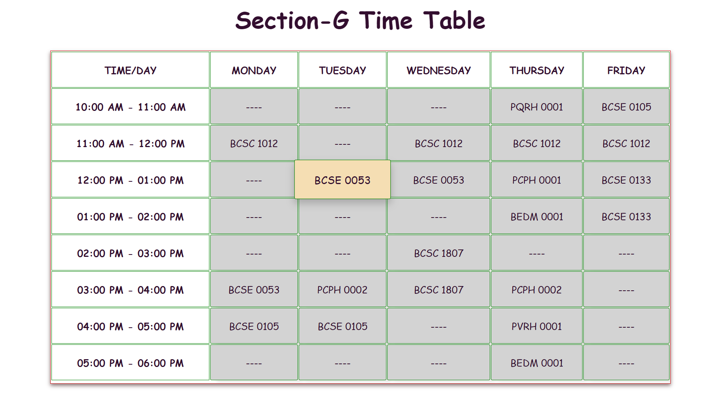
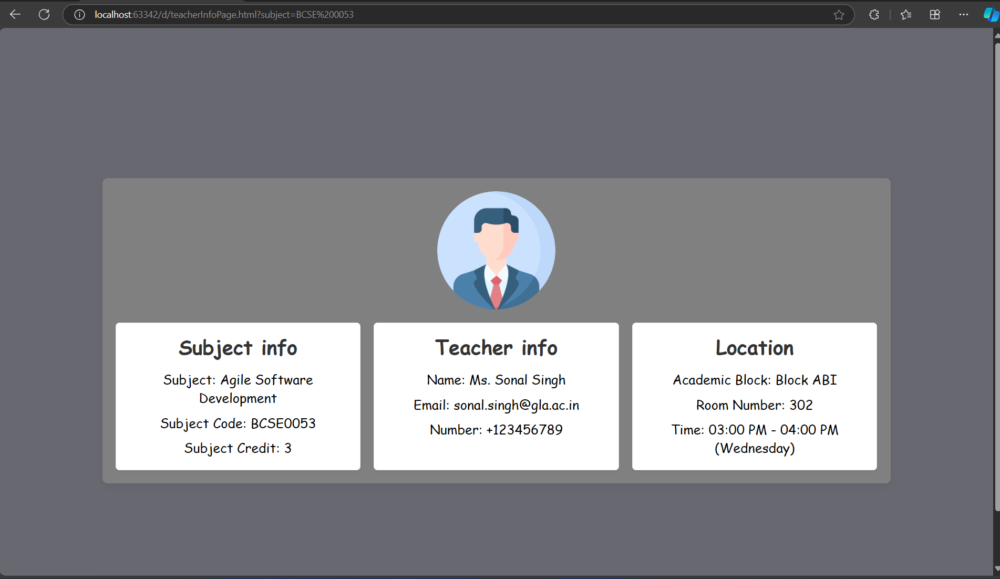

Class Time-Table and Subject Details
This project provides an interactive class time-table and subject details portal for students. Users can view the timetable for a particular section, click on subjects for more information, and access details about the subject, teacher, and classroom. The platform dynamically highlights the current ongoing class and redirects users to relevant subject information.

Features
1. Class Time-Table Display
   Displays a detailed time-table for each day of the week.
   Allows easy navigation to the current day's schedule.
   Highlights the current class based on the real-time clock using a blinking effect.
   Users can see their upcoming classes for better preparation.
2. Current Class Highlight
   Uses JavaScript to detect the current day and time and highlights the ongoing class in the time-table.
   Helps students keep track of their live classes without manually checking the schedule.
3. Clickable Time Slots
   All subjects are clickable, allowing students to quickly navigate to the subject's details page.
   Facilitates easy access to more information about any course by clicking on the subject in the time-table.
4. Subject Details Page
   Provides detailed information about each subject:
   Subject Name
   Subject Code
   Subject Credit
   Teacher Information:
   Teacher Name
   Email Address
   Contact Number
   Location Information:
   Academic Block
   Room Number
   Time of the class.
   Makes it convenient for students to know where and when their class is happening.
5. Dynamic Subject Information
   The subject details page is dynamically populated based on the subject clicked in the time-table.
   Data is retrieved and displayed, ensuring that all relevant information is up-to-date and accurate.
6. Modular JavaScript Functions
   Time-Table Highlighting: JavaScript function to map real-time hours and highlight the current class.
   Subject Click Event: Allows users to click on any subject in the time-table to navigate to a detailed subject page.
   Dynamic Data Rendering: Extracts subject details based on URL parameters and populates the subject details page.
7. Responsive Design
   The project is designed to be mobile-friendly and accessible across different screen sizes.
   Optimized CSS ensures that both the time-table and subject details pages adjust to smaller screens for easy navigation.

